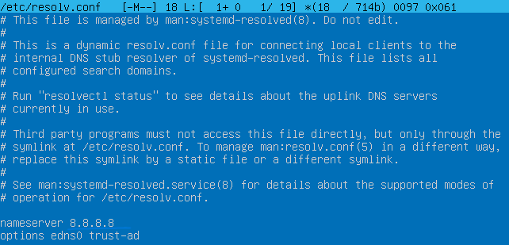

# Сети в Linux

Настройка сетей в Linux на виртуальных машинах.


<details>
  <summary>Contents</summary>

## Contents

1. [Chapter I](#chapter-i)
2. [Chapter II](#chapter-ii) \
   2.1. [Стек протоколов TCP IP](#стек-протоколов-tcp-ip) \
   2.2. [Адресация](#адресация) \
   2.3. [Маршрутизация](#маршрутизация)
3. [Chapter III](#chapter-iii) \
   3.1. [Инструмент ipcalc](#part-1-инструмент-ipcalc) \
   3.2. [Статическая маршрутизация между двумя машинами](#part-2-статическая-маршрутизация-между-двумя-машинами) \
   3.3. [Утилита iperf3](#part-3-утилита-iperf3) \
   3.4. [Сетевой экран](#part-4-сетевой-экран) \
   3.5. [Статическая маршрутизация сети](#part-5-статическая-маршрутизация-сети) \
   3.6. [Динамическая настройка IP с помощью DHCP](#part-6-динамическая-настройка-ip-с-помощью-dhcp) \
   3.7. [NAT](#part-7-nat) \
   3.8. [Допополнительно. Знакомство с SSH Tunnels](#part-8-дополнительно-знакомство-с-ssh-tunnels)
4. [Chapter IV](#chapter-iv)

## Chapter I


В Linux ядро операционной системы хранит таблицу маршрутизации в файле */proc/net/route*. 
Просмотреть текущую таблицу маршрутизации можно командой `netstat -rn` (r - routing table, n - не преобразовывать IP в имена), `route` или `ip r`.

Пример таблицы маршрутизации для хоста eggplant:
```
[root@eggplant ~]# netstat -rn
Kernel IP routing table
Destination     Gateway         Genmask         Flags   MSS Window  irtt Iface
128.17.75.0      128.17.75.20   255.255.255.0   UN        1500 0          0 eth0
default          128.17.75.98   0.0.0.0         UGN       1500 0          0 eth0
127.0.0.1        127.0.0.1      255.0.0.0       UH        3584 0          0 lo
128.17.75.20     127.0.0.1      255.255.255.0   UH        3584 0          0 lo
```

Значения колонок:
- Destination - адреса сетей (хостов) назначения. При этом, при указании сети, адрес обычно заканчивается на ноль. 
- Gateway - адрес шлюза для указанного в первой колонке хоста/сети. Третья колонка - маска подсети, для которой работает данный маршрут. 
- Flags - информация об адресе назначения (U - маршрут работает, N - маршрут для сети, H - маршрут для хоста и т.п.). 
- MSS - число байтов, которое может быть отправлено за 1 раз, 
- Window - количество фреймов, которое может быть отправлено до получения подтверждения, 
- irtt - статистика использования маршрута, 
- Iface - указывает сетевой интерфейс, используемый для маршрута (eth0, eth1 и т.п.)

\> *Как и в прошлый раз, ещё больше полезной информации вы сохраняете в папке materials*
</details>


## Chapter III

В качестве результата работы должен быть предоставлен отчет по выполненным задачам. В каждой части задания указано, что должно быть помещено в отчёт, после её выполнения. Это могут быть ответы на вопросы, скриншоты и т.д.
- В репозиторий, в папку src, должен быть загружен отчёт с расширением .md.
- В отчёте должны быть выделены все части задания, как заголовки 2-го уровня.
- В рамках одной части задания всё, что помещается в отчёт, должно быть оформлено в виде списка.
- Каждый скриншот в отчёте должен быть кратко подписан (что показано на скриншоте).
- Все скриншоты обрезаны так, чтобы была видна только нужная часть экрана.
- На одном скриншоте допускается отображение сразу нескольких пунктов задания, но они все должны быть описаны в подписи к скриншоту.
- На все виртуальные машины, созданные в процессе выполнения задания, устанавливать **Ubuntu 20.04 Server LTS**

## Part 1. Инструмент **ipcalc**

**ipcalc**.


<details>
  <summary>ipcalc</summary>

ipcalc берет IP-адрес и сетевую маску и вычисляет результирующие широковещательную рассылку, сеть, подстановочную маску Cisco и диапазон хостов. Задав вторую сетевую маску, вы можете создавать подсети и суперсети. Он также предназначен для использования в качестве учебного пособия и представляет результаты разделения на подсети в виде простых для понимания двоичных значений.


Введите свои сетевые маски в нотации CIDR (/25) или в десятичном формате с точками (255.255.255.0). Распознаются инверсные маски сети. Если вы опустите сетевую маску, ipcalc использует сетевую маску по умолчанию для класса вашей сети.


Посмотрите на пространство между битами адреса: биты перед ним — это сетевая часть адреса, биты после него — часть хоста. Вы можете видеть два простых факта: в сетевом адресе все биты хоста равны нулю, в широковещательном адресе все они установлены.


Класс вашей сети определяется ее первыми битами .


Если ваша сеть является частным Интернетом в соответствии с RFC 1918, это отмечается. При отображении подсетей новые биты в сетевой части сетевой маски выделены другим цветом .


Подстановочный знак — это обратная сетевая маска, используемая для списков управления доступом в маршрутизаторах Cisco.


Вы хотите разделить свою сеть на подсети? Введите адрес и сетевую маску вашей исходной сети и экспериментируйте со второй сетевой маской, пока результат не будет соответствовать вашим потребностям.
</details>

##### Поднять виртуальную машину (далее -- ws1)

#### 1.1. Сети и маски
##### Определить и записать в отчёт:
##### 1) Адрес сети *192.167.38.54/13*

- 
   | | | |
   |----|----|---|
   |IP-Address:|192.167.38.54|11000000.10100111.00100110.00110110|
   |Netmask:|255.248.0.0 = /13|11111111.11111000.00000000.00000000|
   |Network:|**192.160.0.0/13**|11000000.10100000.00000000.00000000|


##### 2) Перевод маски 


Маска подсети — битовая маска для определения по IP-адресу адреса подсети и адреса узла (хоста, компьютера, устройства) этой подсети. В отличие от IP-адреса маска подсети не является частью IP-пакета.


Благодаря маске можно узнать, какая часть IP-адреса узла сети относится к адресу сети, а какая — к адресу самого узла в этой сети.


- *255.255.255.0* в префиксную и двоичную запись:


   | | | |
   |--------------|----------|---------------------------------|
   |Netmask:|255.255.255.0 = **/24**|**11111111.11111111.11111111.00000000**|


- */15* в обычную и двоичную:


   | | | |
   |----|----|---|
   |Netmask:|**255.254.0.0** = /15|**11111111.11111110.00000000.00000000**|

- *11111111.11111111.11111111.11110000* в обычную и префиксную


   | | | |
   |----|----|---|
   |Netmask:|**255.255.255.240** = **/28**|11111111.11111111.11111111.11110000|


##### 3) Минимальный и максимальный хост в сети *12.167.38.4* 


Размер сети
Количество разрядов в номере сети определяет максимальное количество хостов, которые могут находиться в такой сети. Чем больше бит в номере сети, тем меньше бит остается на идентификатор хоста в адресе.


-  при маске */8* = 255.0.0.0

   |||
   |----------------|------------|
   |HostMin:	|12.0.0.1|
   |HostMax:	|12.255.255.254|
   |Hosts	|16 777 214|

-  при маске *11111111.11111111.00000000.00000000* = /16 = 255.255.0.0

   |||
   |----------------|------------|
   |HostMin:|12.167.0.1|
   |HostMax:|12.167.255.254|
   |Hosts|65 534|

-  при маске *255.255.254.0*  = /23

   |||
   |----------------|------------|
   |HostMin:|12.167.38.1|
   |HostMax:|12.167.39.254|
   |Hosts|510|

-  при маске */4* = 240.0.0.0

   |||
   |----------------|------------|
   |HostMin:	|0.0.0.1|	
   |HostMax:	|15.255.255.254|
   |Hosts|268 435 454|


#### 1.2. localhost
##### Определить и записать в отчёт, можно ли обратиться к приложению, работающему на localhost, со следующими IP: 


localhost (так называемый, «местный» от англ. local, или «локальный хост», по смыслу — этот компьютер) — в компьютерных сетях, стандартное, официально зарезервированное доменное имя для частных IP-адресов (в диапазоне 127.0.0.1 — 127.255.255.254, RFC 2606).


- *194.34.23.100/16* \
   Network:   194.34.0.0/16\
   Class C
   - [ ] НЕТ
- *127.0.0.2/24* \
   Network:   127.0.0.0/24\
   Class A, Loopback
   - [X] Да 
- *127.1.0.1/8* \
   Network:   127.0.0.0/8\
   Class A, Loopback
   - [X] Да 
- *128.0.0.1/8*\
   Network:   128.0.0.0/8\
   Class B
   - [ ] НЕТ

#### 1.3. Диапазоны и сегменты сетей
##### Определить и записать в отчёт:
##### 1) какие из перечисленных IP можно использовать в качестве публичного, а какие только в качестве частных: 

адресом называется IP адрес, который используется для выхода в Интернет. Адреса, используемые в локальных сетях, относят к частным. Частные IP не маршрутизируются в Интернете.

Публичные адреса назначаются публичным веб-серверам для того, чтобы человек смог попасть на этот сервер, вне зависимости от его местоположения, то есть через Интернет. 

Уполномоченной организацией по распределению нумерации в сети Интернет (IANA) специально для частных сетей зарезервированы следующие три блока IP-адресов:

   ||
   |---------------|
   |10.0.0.0 — 10.255.255.255|
   |172.16.0.0 — 172.31.255.255|
   |192.168.0.0 — 192.168.255.255|


IP-адреса указанных частный подсетей иногда называют "серыми".
IP-адреса можно получить через IANA, у своего провайдера услуг Интернет или самостоятельно назначить из диапазона адресов для частных сетей.


- [ ] *10.0.0.45/8*  
      Частная Class A, Private Internet
- [X] *134.43.0.2/16*  
      Публичная Class B
- [ ] *192.168.4.2/16*  
      Частная  Class C, Private Internet
- [ ] *172.20.250.4/12*  
      Частная  Class B, Private Internet
- [X] *172.0.2.1/12*  
      Публичная  Class B
- [ ] *192.172.0.1/12*  
      Частная  Class C, In Part Private Internet
- [X] *172.68.0.2/12*  
      Публичная  Class B
- [ ] *172.16.255.255/12*  
      Частная  Class B, Private Internet
- [ ] *10.10.10.10/8*  
      Частная  Class A, Private Internet
- [X] *192.169.168.1/16*  
      Публичная  Class C


##### 2) какие из перечисленных IP адресов шлюза возможны у сети *10.10.0.0/18*: 

   |||
   |----------|------------|
   |Network:|10.10.0.0/18|
   |HostMin:|10.10.0.1|
   |HostMax:|10.10.63.254|

- [ ] *10.0.0.1* Нет
- [X] *10.10.0.2* **Да**
- [X] *10.10.10.10* **Да** 
- [ ] *10.10.100.1* Нет
- [X] *10.10.1.255* **Да**

## Part 2. Статическая маршрутизация между двумя машинами

##### Поднять две виртуальные машины (далее -- ws1 и ws2)

##### С помощью команды `ip a` посмотреть существующие сетевые интерфейсы
- Cкрин с вызовом и выводом использованной команды:


##### Описать сетевой интерфейс, соответствующий внутренней сети, на обеих машинах и задать следующие адреса и маски: 

- ws1 - *192.168.100.10*, маска */16*, 
- ws2 - *172.24.116.8*, маска */12*

##### Выполнить команду `netplan apply` для перезапуска сервиса сети

- Сскрины с содержанием изменённого файла *etc/netplan/00-installer-config.yaml* для каждой машины:

 

#### 2.1. Добавление статического маршрута вручную
##### Добавить статический маршрут от одной машины до другой и обратно при помощи команды вида `ip r add`
##### Пропинговать соединение между машинами
- Скрин с вызовом и выводом использованных команд:


#### 2.2. Добавление статического маршрута с сохранением
##### Перезапустить машины

- `sudo reboot`

##### Добавить статический маршрут от одной машины до другой с помощью файла *etc/netplan/00-installer-config.yaml*
##### Пропинговать соединение между машинами

- Cкрин с содержанием изменённого файла *etc/netplan/00-installer-config.yaml*. и вызовом и выводом использованной команды:


## Part 3. Утилита **iperf3**

 **iperf3**.

*В данном задании используются виртуальные машины ws1 и ws2 из Части 2*

#### 3.1. Скорость соединения
##### Перевести и записать в отчёт: 
Бит в секунду, бит/с (англ. bits per second, bps) — базовая единица измерения скорости передачи информации, используемая на физическом уровне сетевой модели OSI или TCP/IP.
На более высоких уровнях сетевых моделей, как правило, используется более крупная единица — байт в секунду (Б/c или Bps, от англ. bytes per second) равная 8 бит/c.

- 8 Mbps = 1 MB/s, 
- 100 MB/s = 100*1024*8 Kbps = 819200 Kbpsб 
- 1 Gbps в 1024 Mbps.

#### 3.2. Утилита **iperf3**

<details>
  <summary> iperf3 </summary>
Iperf3 — кроссплатформенная консольная клиент-серверная программа — генератор TCP и UDP трафика для тестирования пропускной способности сети. С ее помощью довольно просто измерить максимальную пропускную способность сети между сервером и клиентом и провести нагрузочное тестирование канала связи.


Использование:

iperf3 [-s | -c хост] [опции]

Общие опции для сервера и клиента:

-p, --port #	номер порта, на котором будет работать сервер/клиент (по умолчанию используется 5201)
-f, --format [kmgKMG]	формат скорости в результатах теста: k (Кбит), K (Кбайт), m (Мбит), M (Мбайт), g (Гбит), G (Гбайт)
-i, --interval #	интервал между выводом результата тестирования, в секундах
-V, --verbose	более детализированный вывод информации
-d, --debug	вывод дополнительной информации для отладки
-v, --version	показать версию
-h, --help	показать справку
Основные опции для сервера:

-s, --server	запуск сервера c отображением информации на экране
-D, --daemon	запуск сервера в фоновом режиме, без отображения информации на экране; будет оставаться запущенным, даже после закрытия окна программы
Основные опции для клиента:

-c, --client <хост>	запуск клиента и подключение к серверу <хосту>
-u, --udp	протокол UDP вместо TCP
-b, --bandwidth #[KMG][/#]	максимальная скорость в битах/сек (0 - отсутствует ограничение); по умолчанию отсутствует ограничение скорости для TCP, а для UDP составляет 1 Мбит/сек (опция /# для пакетного режима передачи данных)
-t, --time #	время тестирования в секундах (по умолчанию 10 сек)
-n, --bytes #[KMG]	количество байт для передачи данных (вместо ключа -t)
-l, --len #[KMG]	размер буфера (по умолчанию 128 КБ для TCP, 8 КБ для UDP)
-P, --parallel #	число одновременных параллельных клиентских потоков
-R, --reverse	запуск в обратном режиме (Reverse mode: сервер отправляет трафик, клиент принимает)
-4, --version4	использовать только IPv4
-6, --version6	использовать только IPv6
-Z, --zerocopy	метод отправки данных по технологии zero copу для снижения нагрузки на процессор
-O, --omit N	пропустить первые n секунд (игнорировать алгоритм TCP slowstart)
--get-server-output	получить результаты с сервера
  
</details>

##### Измерить скорость соединения между ws1 и ws2
- Cкрины с вызовом и выводом использованных команд:


## Part 4. Сетевой экран

*В данном задании используются виртуальные машины ws1 и ws2 из Части 2*

#### 4.1. Утилита **iptables**

<details>
  <summary>iptables</summary>


Для iptables команда — это инструкция к действию, при помощи них можно добавлять, удалять и сбрасывать все правила, задавать действия по умолчанию и многое другое. Команды могут подаваться как в сокращенном, так и в полном виде, более подробно в таблице:

- —append	-A	добавить правило в конец указанной цепочки
- —check	-C	проверить существующие правила в заданной цепочке
- —delete	-D	удалить правило с указанным номером в заданной цепочке
- —insert	-I	вставить правило с заданным номером, без указания номера — правило будет по умолчанию добавлено первым
- —replace	-R	заменить правило с указанным номером
- —list	-L	вывести список всех действующих правил со всех цепочек, если указать интересующую цепочку — вывод будет сделан только по ней
- —list-rules	-S	построчный вывод всех правил во всех цепочках, если после ключа указать имя цепочки — будут выведены только ее правила
- —flush	-F	удалить все правила, при указании имени цепочки — правила удаляться только в ней
- —zero	-Z	обнулить все счетчики во всех цепочках, при указании цепочки — обнуление произойдет только в ней
- —new	-N	создать пользовательскую цепочку
- —delete-chain	-X	удалить пользовательскую цепочку
- —policy	-P	установить политику по умолчанию для цепочки, обычно это ACCEPT или DROP, она будет применена к пакетам, не попавшим ни под один критерий
- —rename-chain	-E	переименовать цепочку, сначала указывается текущее имя, через пробел — новое
- —help	-h	вывести справочную информацию по синтаксису iptables
  
</details>

##### Создать файл */etc/firewall.sh*, имитирующий фаерволл, на ws1 и ws2:
##### Нужно добавить в файл подряд следующие правила:
##### 1) на ws1 применить стратегию когда в начале пишется запрещающее правило, а в конце пишется разрешающее правило (это касается пунктов 4 и 5)
##### 2) на ws2 применить стратегию когда в начале пишется разрешающее правило, а в конце пишется запрещающее правило (это касается пунктов 4 и 5)
##### 3) открыть на машинах доступ для порта 22 (ssh) и порта 80 (http)
##### 4) запретить *echo reply* (машина не должна "пинговаться”)
##### 5) разрешить *echo reply* (машина должна "пинговаться")
- Скрины с содержанием файла */etc/firewall* для каждой машины.


##### Запустить файлы на обеих машинах командами `chmod +x /etc/firewall.sh` и `/etc/firewall.sh`
- Скрины с запуском обоих файлов.


- Разницу между стратегиями, применёнными в первом и втором файлах:


Попав в цепочку пакет последовательно проходит правила в порядке их перечисления до первого срабатывания.


В одном случае, первое срабатывание запрещает, в другом случае разрешает.


#### 4.2. Утилита **nmap**
##### Командой **ping** найти машину, которая не "пингуется", после чего утилитой **nmap** показать, что хост машины запущен
*Проверка: в выводе nmap должно быть сказано: `Host is up`*
- В отчёт поместить скрины с вызовом и выводом использованных команд **ping** и **nmap**.

##### Сохранить дампы образов виртуальных машин


Инструция по сохранению дампа
[тут](https://comphome.ru/virtualbox-virtualnaja-mashina/kak-sohranit-sostojanie-virtualnoj-mashiny-virtualbox.html)


## Part 5. Статическая маршрутизация сети

Сеть: \


##### Поднять пять виртуальных машин (3 рабочие станции (ws11, ws21, ws22) и 2 роутера (r1, r2))

#### 5.1. Настройка адресов машин
##### Настроить конфигурации машин в *etc/netplan/00-installer-config.yaml* согласно сети на рисунке.
- В отчёт поместить скрины с содержанием файла *etc/netplan/00-installer-config.yaml* для каждой машины.

- r1:


- r2:


- ws11:


- ws21:


- ws22:


##### Перезапустить сервис сети. 

`sudo netplan apply`

Если ошибок нет, то командой `ip -4 a` проверить, что адрес машины задан верно. 
- Cкрины с вызовом команды:


- Скрин пинга ws22 с ws21. 


- Скрин пинга r1 с ws11.


#### 5.2. Включение переадресации IP-адресов.
##### Для включения переадресации IP, выполните команду на роутерах:
`sysctl -w net.ipv4.ip_forward=1`
*При таком подходе переадресация не будет работать после перезагрузки системы.*
- Cкрин с вызовом и выводом использованной команды.


##### Откройте файл */etc/sysctl.conf* и добавьте в него следующую строку:
`net.ipv4.ip_forward = 1`
*При использовании этого подхода, IP-переадресация включена на постоянной основе.*
- Cкрин с содержанием изменённого файла */etc/sysctl.conf*.


#### 5.3. Установка маршрута по-умолчанию
Пример вывода команды `ip r` после добавления шлюза:
```
default via 10.10.0.1 dev eth0
10.10.0.0/18 dev eth0 proto kernel scope link src 10.10.0.2
```
##### Настроить маршрут по-умолчанию (шлюз) для рабочих станций. Для этого добавить gateway4 \[ip роутера\] в файле конфигураций
- Cкрины с содержанием файла *etc/netplan/00-installer-config.yaml*:


##### Вызвать `ip r` и показать, что добавился маршрут в таблицу маршрутизации
- Скрин с вызовом и выводом использованной команды:


##### Пропинговать с ws11 роутер r2 и показать на r2, что пинг доходит. Для этого использовать команду:
`tcpdump -tn -i eth1`
- Скрин с вызовом и выводом использованных команд:


#### 5.4. Добавление статических маршрутов
##### Добавить в роутеры r1 и r2 статические маршруты в файле конфигураций. Пример для r1 маршрута в сетку 10.20.0.0/26:
```shell
# Добавить в конец описания сетевого интерфейса eth1:
- to: 10.20.0.0
  via: 10.100.0.12
```
- В отчёт поместить скрины с содержанием изменённого файла *etc/netplan/00-installer-config.yaml* для каждого роутера.

- r1:


- r2:


##### Вызвать `ip r` и показать таблицы с маршрутами на обоих роутерах. Пример таблицы на r1:
- Cкрин с вызовом и выводом использованной команды.

- r1:


- r2:


##### Запустить команды на ws11:
`ip r list 10.10.0.0/[маска сети]` и `ip r list 0.0.0.0/0`
- Cкрин с вызовом и выводом использованных команд.


- В отчёте объяснить, почему для адреса 10.10.0.0/\[порт сети\] был выбран маршрут, отличный от 0.0.0.0/0, хотя он попадает под маршрут по-умолчанию.


Маршрут по умолчанию имеет более низкий приоритет и срабатывает, когда не найден подходящий маршрут в таблице маршрутизации. Для сети 10.10.0.0 мы создали правило, соответственно используется созданный маршрут. Также можно устанавливать метрику, чтобы менять приоритеты маршрутов.

#### 5.5. Построение списка маршрутизаторов
Пример вывода утилиты **traceroute** после добавления шлюза:
```
1 10.10.0.1 0 ms 1 ms 0 ms
2 10.100.0.12 1 ms 0 ms 1 ms
3 10.20.0.10 12 ms 1 ms 3 ms
```
##### Запустить на r1 команду дампа:
`tcpdump -tnv -i eth0`
##### При помощи утилиты **traceroute** построить список маршрутизаторов на пути от ws11 до ws21
- В отчёт поместить скрины с вызовом и выводом использованных команд (tcpdump и traceroute).

- ws11 `traceroute`:


- r1 `tcpdump -tnv -i eth0`:


- В отчёте, опираясь на вывод, полученный из дампа на r1, объяснить принцип работы построения пути при помощи **traceroute**.

Для определения промежуточных маршрутизаторов traceroute отправляет целевому узлу серию ICMP-пакетов (по умолчанию 3 пакета), с каждым шагом увеличивая значение поля TTL («время жизни») на 1. Это поле обычно указывает максимальное количество маршрутизаторов, которое может быть пройдено пакетом. Первая серия пакетов отправляется с TTL, равным 1, и поэтому первый же маршрутизатор возвращает обратно ICMP-сообщение «time exceeded in transit», указывающее на невозможность доставки данных. Traceroute фиксирует адрес маршрутизатора, а также время между отправкой пакета и получением ответа (эти сведения выводятся на монитор компьютера). Затем traceroute повторяет отправку серии пакетов, но уже с TTL, равным 2, что заставляет первый маршрутизатор уменьшить TTL пакетов на единицу и направить их ко второму маршрутизатору. Второй маршрутизатор, получив пакеты с TTL=1, так же возвращает «time exceeded in transit».

Процесс повторяется до тех пор, пока пакет не достигнет целевого узла. При получении ответа от этого узла процесс трассировки считается завершённым.

#### 5.6. Использование протокола **ICMP** при маршрутизации
##### Запустить на r1 перехват сетевого трафика, проходящего через eth0 с помощью команды:
`tcpdump -n -i eth0 icmp`
##### Пропинговать с ws11 несуществующий IP (например, *10.30.0.111*) с помощью команды:
`ping -c 1 10.30.0.111`
- В отчёт поместить скрин с вызовом и выводом использованных команд.

- ws11:


- r1:


##### Сохранить дампы образов виртуальных машин

## Part 6. Динамическая настройка IP с помощью **DHCP**

`-` Следующим нашим шагом будет более подробное знакомство со службой **DHCP**, которую ты уже знаешь.

**== Задание ==**

*В данном задании используются виртуальные машины из Части 5*

##### Указать MAC адрес у ws11, для этого в *etc/netplan/00-installer-config.yaml* надо добавить строки: `macaddress: 10:10:10:10:10:BA`, `dhcp4: true`
- В отчёт поместить скрин с содержанием изменённого файла *etc/netplan/00-installer-config.yaml*.

- ws11:


##### Для r2 настроить в файле */etc/dhcp/dhcpd.conf* конфигурацию службы **DHCP**:
##### 1) указать адрес маршрутизатора по-умолчанию, DNS-сервер и адрес внутренней сети. Пример файла для r2:
```shell
subnet 10.100.0.0 netmask 255.255.0.0 {}

subnet 10.20.0.0 netmask 255.255.192.0
{
    range 10.20.0.2 10.20.0.50;
    option routers 10.20.0.1;
    option domain-name-servers 10.20.0.1;
}
```

- r2:

 


##### 2) в файле *resolv.conf* прописать `nameserver 8.8.8.8.`

- Срины с содержанием изменённых файлов.



##### Перезагрузить службу **DHCP** командой `systemctl restart isc-dhcp-server`. 

- r2:


##### Машину ws21 перезагрузить при помощи `reboot` и через `ip a` показать, что она получила адрес. Также пропинговать ws22 с ws21.
- Скрины с вызовом и выводом использованных команд.


##### Для r1 настроить аналогично, но сделать выдачу адресов с жесткой привязкой к MAC-адресу (ws11). Провести аналогичные тесты

- r1 `*/etc/dhcp/dhcpd.conf`

 

- r1 `resolv.conf`


- r1 `systemctl restart isc-dhcp-server`


##### Запросить с ws21 обновление ip адреса
- Cкрины ip до и после обновления.


- В отчёте описать, какими опциями **DHCP** сервера пользовались в данном пункте.

Чтобы обновить или освободить IP-адрес для конкретного интерфейса, например, enp0s8, введите:
- `sudo dhclient -r enp0s8` -r – освободить текущий адрес; 
- `sudo dhclient enp0s8` - получить адрес для интерфейса enp0s8 


##### Сохранить дампы образов виртуальных машин

## Part 7. **NAT**
**== Задание ==**

*В данном задании используются виртуальные машины из Части 5*
##### В файле */etc/apache2/ports.conf* на ws22 и r2 изменить строку `Listen 80` на `Listen 0.0.0.0:80`, то есть сделать сервер Apache2 общедоступным
- Cкрин с содержанием изменённого файла.


##### Запустить веб-сервер Apache командой `service apache2 start` на ws22 и r1
- Cкрины с вызовом и выводом использованной команды.


##### Добавить в фаервол, созданный по аналогии с фаерволом из Части 4, на r2 следующие правила:
##### 1) Удаление правил в таблице filter - `iptables -F`
##### 2) Удаление правил в таблице "NAT" - `iptables -F -t nat`
##### 3) Отбрасывать все маршрутизируемые пакеты - `iptables --policy FORWARD DROP`
##### Запускать файл также, как в Части 4
##### Проверить соединение между ws22 и r1 командой `ping`
*При запуске файла с этими правилами, ws22 не должна "пинговаться" с r1*
- В отчёт поместить скрины с вызовом и выводом использованной команды.


##### Добавить в файл ещё одно правило:
##### 4) Разрешить маршрутизацию всех пакетов протокола **ICMP**
##### Запускать файл также, как в Части 4
##### Проверить соединение между ws22 и r1 командой `ping`
*При запуске файла с этими правилами, ws22 должна "пинговаться" с r1*
- Скрины с вызовом и выводом использованной команды.


##### Добавить в файл ещё два правила:
##### 5) Включить **SNAT**, а именно маскирование всех локальных ip из локальной сети, находящейся за r2 (по обозначениям из Части 5 - сеть 10.20.0.0)
*Совет: стоит подумать о маршрутизации внутренних пакетов, а также внешних пакетов с установленным соединением*
##### 6) Включить **DNAT** на 8080 порт машины r2 и добавить к веб-серверу Apache, запущенному на ws22, доступ извне сети
*Совет: стоит учесть, что при попытке подключения возникнет новое tcp-соединение, предназначенное ws22 и 80 порту*
- Скрин с содержанием изменённого файла.


##### Запускать файл также, как в Части 4
*Перед тестированием рекомендуется отключить сетевой интерфейс **NAT** (его наличие можно проверить командой `ip a`) в VirtualBox, если он включен*
##### Проверить соединение по TCP для **SNAT**, для этого с ws22 подключиться к серверу Apache на r1 командой:
`telnet [адрес] [порт]`
##### Проверить соединение по TCP для **DNAT**, для этого с r1 подключиться к серверу Apache на ws22 командой `telnet` (обращаться по адресу r2 и порту 8080)
- В отчёт поместить скрины с вызовом и выводом использованных команд.


##### Сохранить дампы образов виртуальных машин

## Part 8. Дополнительно. Знакомство с **SSH Tunnels**
**== Задание ==**

*В данном задании используются виртуальные машины из Части 5*

##### Запустить веб-сервер **Apache** на ws22 только на localhost (то есть не изменять файл */etc/apache2/ports.conf* или, если был изменен ранее, вернуть строку `Listen 80`)
##### Воспользоваться *Local TCP forwarding* с ws21 до ws22, чтобы получить доступ к веб-серверу на ws22 с ws21
##### Воспользоваться *Remote TCP forwarding* c ws11 до ws22, чтобы получить доступ к веб-серверу на ws22 с ws11
##### Для проверки, сработало ли подключение в обоих предыдущих пунктах, перейдите во второй терминал (например, клавишами Alt + F2) и выполните команду:
`telnet 127.0.0.1 [локальный порт]`
- В отчёте описать команды, необходимые для выполнения этих четырёх пунктов, а также приложить скриншоты с их вызовом и выводом.

Магия SSH
[тут](https://habr.com/ru/post/331348/)

Чтобы осуществить проброс портов, потребуется создание SSH tunnel. Для этого в локальной системе открывается порт, а для создания канала связи пользователь должен выбрать порт на другом конце туннеля:


`$ ssh  -L 9999:127.0.0.1:80 remoteserver` Команда устанавливает прослушку на порт 9999. Порт 80 используется для проброса. Для Port Forwarding также используются прокси-серверы или TCP-службы.


Обратный SSH-туннель (SSH reverse tunnel) Очевидно, что SSH tunnel можно создать и в обратном направлении. Достаточно подключить прослушивающий порт к другому локальному порту:
`$ ssh -R 9999:127.0.0.1:9999 remoteserver`


- коннект с ws11 на ws21


- коннект с ws21 на ws22


- новое окно (Alt + F2) на ws11


##### Сохранить дампы образов виртуальных машин
