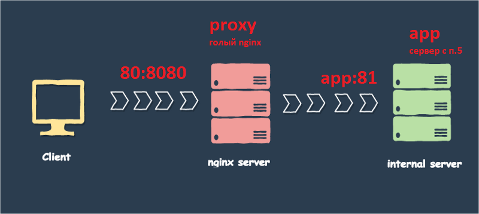

# Simple Docker

## Chapter III

- Необходимо быть готовым продемонстрировать решение вживую при необходимости.

## Part 1. Готовый докер

В качестве результата работы по первым двум задачам должен быть предоставлен отчет.

В качестве конечной цели своей небольшой практики вы сразу выбрали написание докер образа для собственного веб сервера, а потому в начале вам нужно разобраться с уже готовым докер образом для сервера.
Ваш выбор пал на довольно простой **nginx**.

**== Задание ==**

- Проверка, что docker установлен:`sudo docker version`

##### Взять официальный докер образ с **nginx** и выкачать его при помощи `docker pull`

- `sudo docker pull nginx`

- Результат: 


##### Проверить наличие докер образа через `docker images`

- `sudo docker images`

- Результат: 


##### Запустить докер образ через `docker run -d [image_id|repository]`

- `sudo docker run -d f2f70adc5d89`

##### Проверить, что образ запустился через `docker ps`

- `sudo docker ps`

##### Посмотреть информацию о контейнере через `docker inspect [container_id|container_name]`

- `sudo docker inspect 0e8f66cded26`

- Результат: 


##### По выводу команды определить и поместить в отчёт размер контейнера, список замапленных портов и ip контейнера

```
"NetworkSettings": {
          .....
            "Ports": {
                "80/tcp": null
            },
            ....
         "Networks": {
                "bridge": {
                  .....
                    "Gateway": "172.17.0.1",
                    "IPAddress": "172.17.0.2",

```

```
REPOSITORY   TAG       IMAGE ID       CREATED      SIZE
nginx        latest    f2f70adc5d89   7 days ago   142MB

```
- размер контейнера: 142MB
- список замапленных портов: "80/tcp": null
- ip контейнера: 172.17.0.2

##### Остановить докер образ через `docker stop [container_id|container_name]`

- `sudo docker stop f2f70adc5d89` `sudo docker stop heuristic_shtern`

- Результат: 


##### Проверить, что образ остановился через `docker ps`
##### Запустить докер с замапленными портами 80 и 443 на локальную машину через команду *run*

- `sudo docker run -d -p 80:80 -p 443:443 f2f70adc5d89`

- Результат: 


##### Проверить, что в браузере по адресу *localhost:80* доступна стартовая страница **nginx**


- Cтартовая страницы **nginx** по адресу *localhost:80* (адрес должен быть виден). 


##### Перезапустить докер контейнер через `docker restart [container_id|container_name]`

- `sudo docker restart heuristic_shtern`


##### Проверить любым способом, что контейнер запустился

- `curl localhost:80`

- Рузельтат:


## Part 2. Операции с контейнером

В качестве результата работы по первым двум задачам должен быть предоставлен отчет.

Докер образ и контейнер готовы. Теперь можно покопаться в конфигурации **nginx** и отобразить статус страницы.

**== Задание ==**

##### Прочитать конфигурационный файл *nginx.conf* внутри докер образа через команду *exec*

- Интерактивный режим:

`sudo docker exec -it d472532c93db  bash`

`cat etc/nginx/nginx.conf`

`exit`

- Другой вариант

`sudo docker exec sleepy_tesla cat etc/nginx/nginx.conf`

- Рузельтат:


##### Создать на локальной машине файл *nginx.conf*

`sudo docker exec sleepy_tesla cat etc/nginx/nginx.conf > nginx.conf`

##### Настроить в нем по пути */status* отдачу страницы статуса сервера **nginx**
```
.....
http {
    server {
        listen 80;
        listen [::]:80;
        location = /status {
            stub_status on;
        }
    }
  ........
  #include /etc/nginx/conf.d/*.conf;
}
```
- Рузельтат:


##### Скопировать созданный файл *nginx.conf* внутрь докер образа через команду `docker cp`

- `sudo docker cp DO5_SimpleDocker-0/src/nginx.conf  sleepy_tesla:etc/nginx/nginx.conf`

##### Перезапустить **nginx** внутри докер образа через команду *exec*

- `sudo docker exec sleepy_tesla nginx -s reload`

##### Проверить, что по адресу *localhost:80/status* отдается страничка со статусом сервера **nginx**

- Рузельтат:


##### Экспортировать контейнер в файл *container.tar* через команду *export*

- `sudo docker container export brave_dijkstra > container.tar`
- `sudo docker container export -o container.tar brave_dijkstra`

##### Остановить контейнер

- `sudo docker stop brave_dijkstra`

##### Удалить образ через `docker rmi [image_id|repository]`, не удаляя перед этим контейнеры

- `sudo docker rmi -f cbffbae85d9c`

##### Импортировать контейнер обратно через команду *import*

- `sudo docker import container.tar rdontos_img`

##### Запустить импортированный контейнер

- `sudo docker run -itd rdontos_img bash`

- Рузельтат:


## Part 3. Мини веб-сервер


В качестве результата работы по третьей задаче должны быть предоставлены исходные файлы для запуска веб-сервера.


- В репозиторий, в папку src/server, должны быть загружены исходные файлы для запуска веб-сервера из третьего задания.


Настало время немного оторваться от докера, чтобы подготовиться к последнему этапу. Настало время написать свой сервер.

**== Задание ==**

- качаем образ, запускаем: 

`sudo docker pull nginx`

`sudo docker images`

`sudo docker run -d -p 81:81 12766a6745ee`

`sudo docker ps`

##### Написать мини сервер на **C** и **FastCgi**, который будет возвращать простейшую страничку с надписью `Hello World!`


```
#include "fcgi_stdio.h"
#include <stdlib.h>

int main(void)
{
    while(FCGI_Accept() >= 0)
    {
        printf("Content-type: text/html\r\nStatus: 200 OK\r\n\r\nHello World!\n");
    }

    return 0;
}

```

##### Написать свой *nginx.conf*, который будет проксировать все запросы с 81 порта на *127.0.0.1:8080*

```
user  nginx;
.....
http {
    server {
        listen 81;
        listen [::]:81;

        location / {
            fastcgi_pass 127.0.0.1:8080;
        }
    }
    ......
    #include /etc/nginx/conf.d/*.conf;
}
```

- копируем main.c и nginx.conf внутрь контейнера: 

`sudo docker cp DO5_SimpleDocker-0/src/server/main.c eager_morse:home/main.c`

`sudo docker cp DO5_SimpleDocker-0/src/server/nginx.conf eager_morse:etc/nginx/nginx.conf`


##### Запустить написанный мини сервер через *spawn-cgi* на порту 8080


- входим в интерактивный режим:

`sudo docker exec -it eager_morse bash`

- устанавливаем необходимые програмы в контейнер


```
apt update    
apt-get install libfcgi-dev
apt-get install spawn-fcgi
apt-get install gcc
```

- компилируем и запускаем на 8080 порту нашу программу:

```
gcc main.c -lfcgi -o main
spawn-fcgi -p 8080 ./main
```

- выходим обратно из контейнера

`exit`

- перезапускаем, либо стартуем nginx

`sudo docker exec eager_morse  service nginx start`

`sudo docker exec eager_morse  nginx -s reload`


##### Проверить, что в браузере по *localhost:81* отдается написанная вами страничка

- смотрим результат: 

`curl 127.0.0.1:81`


##### Положить файл *nginx.conf* по пути *./nginx/nginx.conf* (это понадобиться позже)

## Part 4. Свой докер

**== Задание ==**

#### Написать свой докер образ, который:
##### 1) собирает исходники мини сервера на FastCgi из [Части 3](#part-3-мини-веб-сервер)
##### 2) запускает его на 8080 порту
##### 3) копирует внутрь образа написанный *./nginx/nginx.conf*
##### 4) запускает **nginx**.
_**nginx** можно установить внутрь докера самостоятельно, а можно воспользоваться готовым образом с **nginx**'ом, как базовым._

- Dockerfile:

```
FROM nginx
COPY ./main.c /home/main.c
COPY ./start.sh /home/start.sh
COPY ./nginx/nginx.conf /etc/nginx/nginx.conf
EXPOSE 81/tcp
USER root
RUN apt-get update ; \
    apt-get install -y gcc spawn-fcgi libfcgi-dev ; \
    apt-get clean ; \
    rm -rf /var/lib/apt/lists/*
WORKDIR /home/
HEALTHCHECK --interval=10s --timeout=30s --start-period=5s --retries=3 CMD curl -sS 127.0.0.1 || exit 1
ENTRYPOINT ["sh", "./start.sh"]
```

- start.sh:

```
#!/bin/bash
gcc main.c -lfcgi -o main
spawn-fcgi -p 8080 ./main
service nginx start
/bin/bash
```

##### Собрать написанный докер образ через `docker build` при этом указав имя и тег

- `sudo docker build -t myserver:current .` 

##### Проверить через `docker images`, что все собралось корректно

- `sudo docker images`

##### Запустить собранный докер образ с маппингом 81 порта на 80 на локальной машине и маппингом папки *./nginx* внутрь контейнера по адресу, где лежат конфигурационные файлы **nginx**'а (см. [Часть 2](#part-2-операции-с-контейнером))

- `sudo docker run -it -p 80:81 --name testserver -v /home/student/DO5_SimpleDocker-0/src/server/nginx/:/etc/nginx -d myserver:current bash`


##### Проверить, что по localhost:80 доступна страничка написанного мини сервера

- `curl localhost:80`

##### Дописать в *./nginx/nginx.conf* проксирование странички */status*, по которой надо отдавать статус сервера **nginx**
##### Перезапустить докер образ
*Если всё сделано верно, то, после сохранения файла и перезапуска контейнера, конфигурационный файл внутри докер образа должен обновиться самостоятельно без лишних действий*

- Содержимое nginx.conf:

```
user  nginx;
.....
http {
    server {
        listen 81;
        listen [::]:81;

        location / {
            fastcgi_pass 127.0.0.1:8080;
        }
        location = /status {
            stub_status on;
        }
    }
    #include       /etc/nginx/mime.types;
    ......
    #include /etc/nginx/conf.d/*.conf;
}
```

- `sudo docker restart testserver`
 
##### Проверить, что теперь по *localhost:80/status* отдается страничка со статусом **nginx**


- `curl localhost:80/status`
- `curl localhost:80`

- Скриншот: 


#### Экспортировать контейнер в файл *container.tar* через команду *export*

- `sudo docker container export testserver > container4.tar`

- Остановить контейнер  

    `sudo docker stop testserver`

- Удалить образ, удалить контейнеры  

    `sudo docker rm $(sudo docker ps -a -f status=exited -q)`  
    
    `sudo docker rmi $(sudo docker images -a -q)`

- Импортировать контейнер 

    `sudo docker import container4.tar myserver:current`

- Запустить импортированный контейнер  

    `sudo docker images`

    `sudo docker run -it -p 80:81 --name testserver -v /home/student/DO5_SimpleDocker-0/src/server/nginx/:/etc/nginx -d myserver:current bash`

- (запускаем nginx внутри контейнера)

    `sudo docker exec testserver  spawn-fcgi -p 8080 home/main`

    `sudo docker exec testserver  service nginx start`

- Проверить: 

    `curl localhost:80/status`  


- В репозиторий, в папку src, должны быть загружены итоговые докер образы из четвёртого и пятого заданий.

## Part 5. **Dockle**

Установка в Linux

```
#Ubuntu
$ VERSION=$(
 curl --silent "https://api.github.com/repos/goodwithtech/dockle/releases/latest" | \
 grep '"tag_name":' | \
 sed -E 's/.*"v([^"]+)".*/\1/' \
) && curl -L -o dockle.deb https://github.com/goodwithtech/dockle/releases/download/v${VERSION}/dockle_${VERSION}_Linux-64bit.deb
$ sudo dpkg -i dockle.deb && rm dockle.deb
```


- В репозиторий, в папку src, должны быть загружены итоговые докер образы из четвёртого и пятого заданий.


**== Задание ==**

##### Просканировать контейнер из предыдущего задания через `dockle [container_id|container_name]`

    `sudo dockle myserver:new`


##### Исправить контейнер так, чтобы при проверке через **dockle** не было ошибок и предупреждений (FATAL и WARN)

- Добавим пользователя nginx в группу adm, и изменим владельца для папок, для работы с nginx. А так же сделаем скрипт исполняемым.

```
FROM nginx

ARG USERNAME=nginx

USER root

COPY ./main.c /home/$USERNAME/main.c
COPY ./start.sh /home/$USERNAME/start.sh
COPY ./nginx/nginx.conf /etc/nginx/nginx.conf

EXPOSE 81/tcp

RUN apt-get update ; \
    apt-get install -y gcc spawn-fcgi libfcgi-dev ; \
    apt-get clean ; \
    rm -rf /var/lib/apt/lists/* ; 

WORKDIR /home/$USERNAME

RUN usermod -aG adm,root,nginx $USERNAME; \
    chown -R $USERNAME:$USERNAME /var/cache/nginx/ ; \
    chown -R $USERNAME:$USERNAME /var/run/ ; \
    chown -R $USERNAME:$USERNAME /home/$USERNAME/ ; \
    chmod +x /home/$USERNAME/start.sh

USER $USERNAME

HEALTHCHECK --interval=10s --timeout=30s --start-period=5s --retries=3 CMD curl -sS 127.0.0.1 || exit 1

ENTRYPOINT ["sh", "./start.sh"]
```

- после чего соберем с новым тегом, отличным от latest

    `sudo docker build -t myserver:new .`

- проверим

    `sudo dockle myserver:new `

- уберем INFO

    `sudo dockle -i CIS-DI-0005 -i CIS-DI-0008  myserver:new `

[linux](img/14.png)

- запустим и проверим на работоспособность:

    `sudo docker run -it -p 80:81 --name testserver -v /home/student/DO5_SimpleDocker-0/src/server/nginx/:/etc/nginx -d myserver:new bash`


- для остановки, и последующей пересборки не забываем удалять

```
    sudo docker stop testserver
    sudo docker rm $(sudo docker ps -a -f status=exited -q)
    sudo docker images
    sudo docker rmi 79062bea509c (оставляем только nginx)
```

- Экспортировать контейнер в файл *container5.tar* через команду *export*

    `sudo docker container export testserver > container5.tar`

- Остановить контейнер  

    `sudo docker stop testserver`

- Удалить образ, удалить контейнеры  

    `sudo docker rm $(sudo docker ps -a -f status=exited -q)`  

    `sudo docker rmi $(sudo docker images -a -q)`

- Импортировать контейнер 

    `sudo docker import container5.tar myserver:current`

- Запустить импортированный контейнер  

    `sudo docker images`

    `sudo docker run -it -p 80:81 --name testserver -v /home/student/DO5_SimpleDocker-0/src/server/nginx/:/etc/nginx -d myserver:current bash`

- (запускаем nginx внутри контейнера)

    `sudo docker exec testserver  spawn-fcgi -p 8080 home/nginx/main`

    `sudo docker exec testserver  service nginx start`

- Проверить:

    `curl localhost:80/status`

    `curl localhost:80`  

- В репозиторий, в папку src, должны быть загружены итоговые докер образы из четвёртого и пятого заданий.


## Part 6. Базовый **Docker Compose**

В качестве результата работы по шестой задаче должен быть предоставлен файл *docker-compose.yml* и нужные для его запуска докер образы (если они не были предоставлены ранее).

- В репозиторий, в папку src, должен быть загружен *docker-compose.yml* шестого задания.

Вот вы и закончили вашу разминку. А хотя погодите...
Почему бы не поэкспериментировать с развёртыванием проекта, состоящего сразу из нескольких докер образов?

**== Задание ==**

##### Написать файл *docker-compose.yml*, с помощью которого:
##### 1) Поднять докер контейнер из [Части 5](#part-5-инструмент-dockle) _(он должен работать в локальной сети, т.е. не нужно использовать инструкцию **EXPOSE** и мапить порты на локальную машину)_

- Содержимое docker-compose

```
services:
  appserver:
    container_name: appserver
    build: ./server5
    restart: always
    links:
     - proxyserver

  proxyserver:
    container_name: proxyserver
    image: nginx
    restart: always
    ports:
      - 80:8080
    volumes:
      - ./proxyserver/nginx/:/etc/nginx/

```
##### 2) Поднять докер контейнер с **nginx**, который будет проксировать все запросы с 8080 порта на 81 порт первого контейнера

- Содержимое nginx.conf proxy сервера:

```
........
http {
    server {
        listen 8080;
        listen [::]:8080;
        location / {
			proxy_pass http://appserver:81;
		}
        location = /proxy {
            stub_status on;
        }
    }
........ 
```
##### Замапить 8080 порт второго контейнера на 80 порт локальной машины



##### Остановить все запущенные контейнеры
##### Собрать и запустить проект с помощью команд `docker-compose build` и `docker-compose up`

`sudo docker-compose build`

`sudo docker-compose up`

##### Проверить, что в браузере по *localhost:80* отдается написанная вами страничка, как и ранее


- Завершить и удалить

`sudo docker-compose down`

- вывод в консоль:

