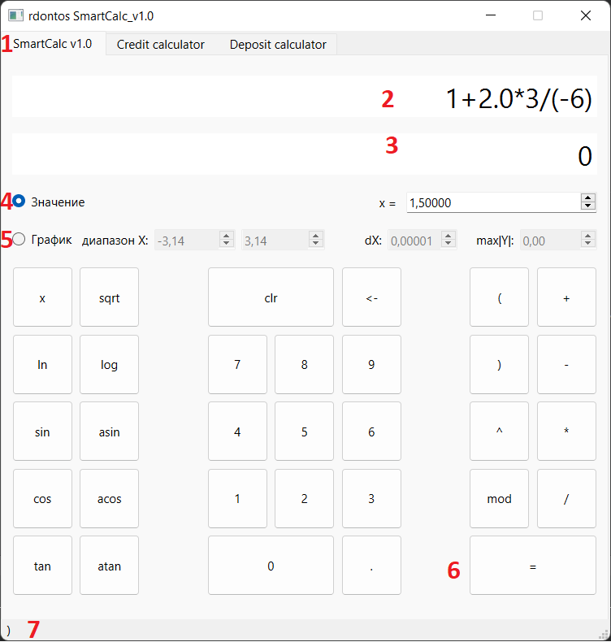
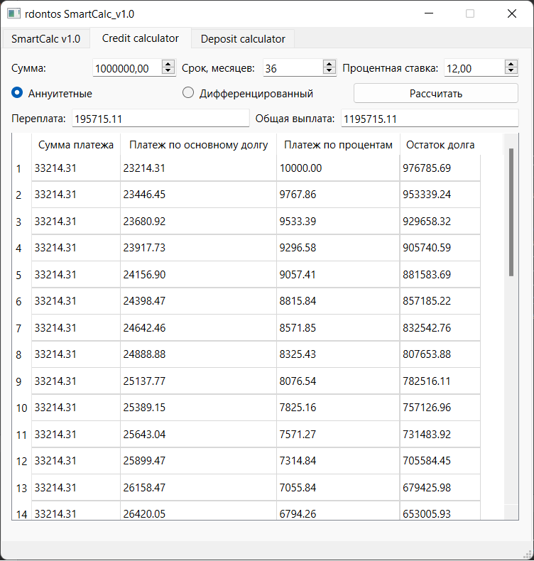
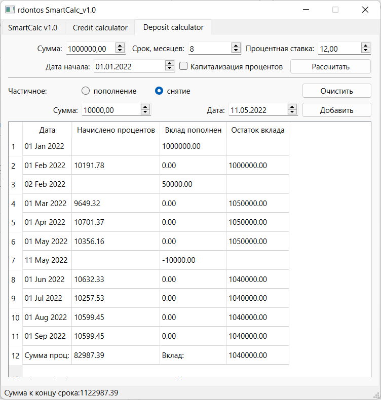
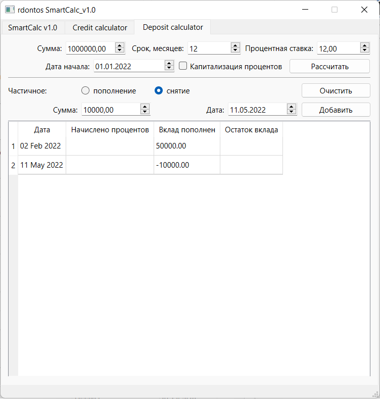

# SmartCalc v1.0

Реализация SmartCalc v1.0.

## Chapter III

## Part 1. Реализация SmartCalc v1.0

Необходимо реализовать программу SmartCalc v1.0:

- Программа должна быть разработана на языке Си стандарта C11 с использованием компилятора gcc. Допустимо использование дополнительных библиотек и модулей QT
- Код программы должен находиться в папке src
- Сборка программы должна быть настроена с помощью Makefile со стандартным набором целей для GNU-программ: all, install, uninstall,clean, dvi, dist, tests, gcov_report. Установка может вестись в любой другой произвольный каталог
- Программа должна быть разработана в соответствии с принципами структурного программирования
- Должно быть обеспечено покрытие unit-тестами модулей, связанных с вычислением выражений, с помощью библиотеки Check
- Реализация с графическим пользовательским интерфейсом, на базе любой GUI-библиотеки с API для C89/C99/C11 (GTK+, Nuklear, raygui, microui, libagar, libui, IUP, LCUI, CEF, Qt, etc.)
- На вход программы могут подаваться как целые числа, так и вещественные числа, записанные через точку. По желанию можно обрабатывать ввод чисел в экспоненциальной записи
- Вычисление должно производится после полного ввода вычисляемого выражения и нажатия на символ `=`
- Вычисление произвольных скобочных арифметических выражений в инфиксной нотации
- Вычисление произвольных скобочных арифметических выражений в инфиксной нотации с подстановкой значения переменной _x_ в виде числа
- Построение графика функции, заданной с помощью выражения в инфиксной нотации с переменной _x_ (с координатными осями, отметкой используемого масштаба и сеткой с адаптивным шагом)
  - Не требуется предоставлять пользователю возможность менять масштаб
- Область определения и область значения функций ограничиваются по крайней мере числами от -1000000 до 1000000
  - Для построения графиков функции необходимо дополнительно указывать отображаемые область определения и область значения
- Проверяемая точность дробной части - минимум 7 знаков после запятой
- У пользователя должна быть возможность ввода до 255 символов
- Скобочные арифметические выражения в инфиксной нотации должны поддерживать следующие арифметические операции и математические функции:

  - **Арифметические операторы**:

    | Название оператора   | Инфиксная нотация   (Классическая) | Префиксная нотация   (Польская нотация) | Постфиксная нотация   (Обратная польская нотация) |
    | -------------------- | --------------------------------------- | -------------------------------------------- | ------------------------------------------------------ |
    | Скобки               | (a + b)                                 | (+ a b)                                      | a b +                                                  |
    | Сложение             | a + b                                   | + a b                                        | a b +                                                  |
    | Вычитание            | a - b                                   | - a b                                        | a b -                                                  |
    | Умножение            | a \* b                                  | \* a b                                       | a b \*                                                 |
    | Деление              | a / b                                   | / a b                                        | a b \                                                  |
    | Возведение в степень | a ^ b                                   | ^ a b                                        | a b ^                                                  |
    | Остаток от деления   | a mod b                                 | mod a b                                      | a b mod                                                |
    | Унарный плюс         | +a                                      | +a                                           | a+                                                     |
    | Унарный минус        | -a                                      | -a                                           | a-                                                     |

    > Обратите внимание, что оператор умножения содержит обязательный знак `*`. Обработка выражения с опущенным знаком `*` является необязательной и остается на усмотрение разработчика

  - **Функции**:

    | Описание функции               | Функция |
    | ------------------------------ | ------- |
    | Вычисляет косинус              | cos(x)  |
    | Вычисляет синус                | sin(x)  |
    | Вычисляет тангенс              | tan(x)  |
    | Вычисляет арккосинус           | acos(x) |
    | Вычисляет арксинус             | asin(x) |
    | Вычисляет арктангенс           | atan(x) |
    | Вычисляет квадратный корень    | sqrt(x) |
    | Вычисляет натуральный логарифм | ln(x)   |
    | Вычисляет десятичный логарифм  | log(x)  |

- Скриншот программы:

- Инструкция

1. выбор режима (калькулятор / кредитный калькулятор / депозитный калькулятор).

2. Поле ввода арифметических операций

3. Поле вывода результата

4. Режим подстановки значения _х_ из поля spinBox

5. Режим построения графика

6. Кнопка получения результата.

7. Строка состояния, выводит последнюю введённую команду

- Для ввода команд необходимо использовать кнопки с их обозначением.

- Для построения графика, необходимо выбрать режим 5, и после введения выражения нажать на клавишу "=", при необходимости, можно поменять отображаемую область. Значение max |Y| ограничивает график сверху и снизу, при значении 0, график выбирает автоматически диапазон. При установленном значении, если график помещается в меньшие пределы, будет выбран автоматически меньший предел.

- Скриншот режима построения графика:

- Окно вывода графика:

## Part 2. Дополнительно. Кредитный калькулятор

Предусмотреть специальный режим "кредитный калькулятор" (за образец можно взять сайты banki.ru и calcus.ru):

- Вход: общая сумма кредита, срок, процентная ставка, тип (аннуитетный, дифференцированный)
- Выход: ежемесячный платеж, переплата по кредиту, общая выплата

- Скриншот программы:

- при введении всех необходимых значений и выбора типа, необходимо нажать кнопку Рассчитать.

## Part 3. Дополнительно. Депозитный калькулятор

Предусмотреть специальный режим "калькулятор доходности вкладов" (за образец можно взять сайты banki.ru и calcus.ru):

- Вход: сумма вклада, срок размещения, процентная ставка, капитализация процентов, список пополнений, список частичных снятий
- Выход: начисленные проценты, сумма на вкладе к концу срока

- Скриншот программы:

- Скриншот добавления пополнений/снятий:

- при добавлении пополнений/снятий, они хранятся в памяти, до тех пор, пока не будет нажата клавиша "Очистить", можно менять срок, сумму, капитализацию процентов и перестраивать график.
  В самом низу таблицы представлены итоговые показатели, сумма начисленных процентов, сумма на вкладе. Итоговый баланс представлен в статус баре.
