# 3DViewer v1.0

1. [Описание программы](#part-1-3dviewer) 
2. [Дополнительно. Настройки](#part-2-дополнительно-настройки) 
3. [Дополнительно. Запись](#part-3-дополнительно-запись)   

## Part 1. 3DViewer

Программа для визуализации каркасной модели в трёхмерном пространстве

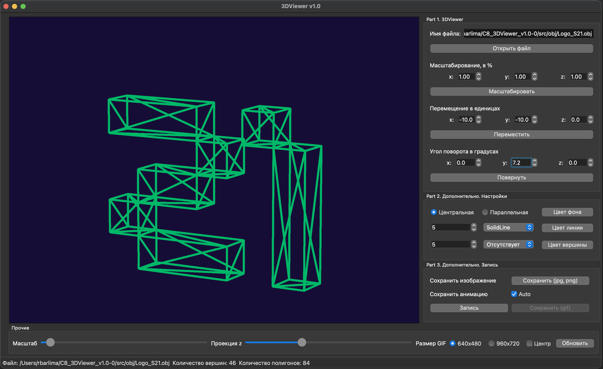

Программа разработана на языке Си стандарта C11 с использованием компилятора gcc.

- Программа должна быть разработана на языке Си стандарта C11 с использованием компилятора gcc. Допустимо использование дополнительных библиотек и модулей QT
- Код программы должен находиться в папке src 

- Сборка программы настроена с помощью Makefile со стандартным набором целей для GNU-программ: all, install, uninstall,clean, dvi, dist, tests, gcov_report. Установка происходит в каталог "build"

- Программа разработана в соответствии с принципами структурного программирования

- Обеспечено покрытие unit-тестами модулей, связанных с загрузкой моделей и аффинными преобразованиями

- В один момент времени может быть только одна модель на экране.

- Программа предоставляет возможность:
    - Загружать каркасную модель из файла формата obj (поддержка только списка вершин и поверхностей).
    - Перемещать модель на заданное расстояние относительно осей X, Y, Z.
    - Поворачивать модель на заданный угол относительно своих осей X, Y, Z
    - Масштабировать модель на заданное значение.

- Пользовательский интерфейс реализован на базе фреймворка Qt.

- Графический пользовательский интерфейс содержит элементы:
    - Кнопку для выбора файла с моделью и поле для вывода его названия.
  
  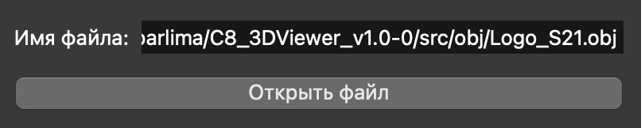

    - Зону визуализации каркасной модели.

  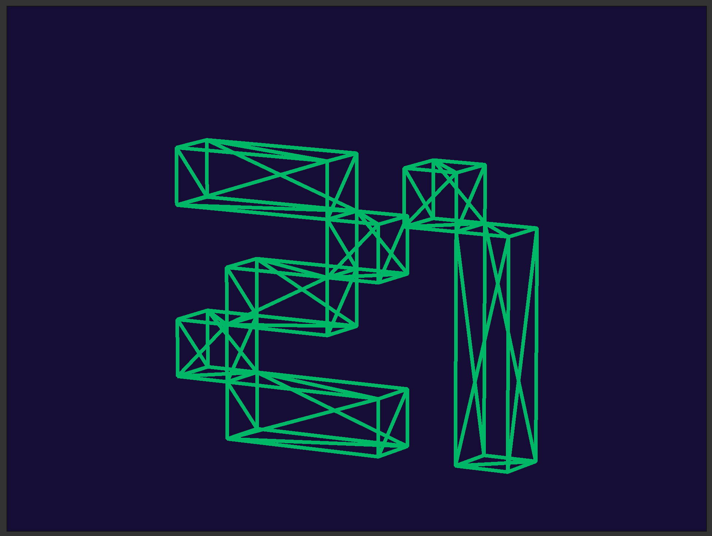

    - Кнопку/кнопки и поля ввода для перемещения модели. 

  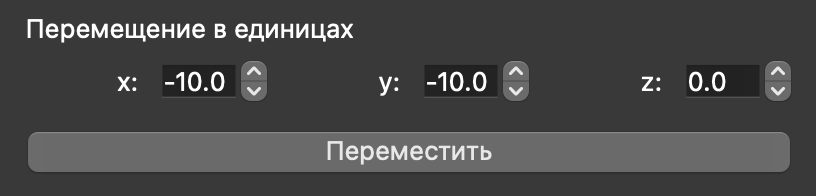

    - Кнопку/кнопки и поля ввода для поворота модели. 

  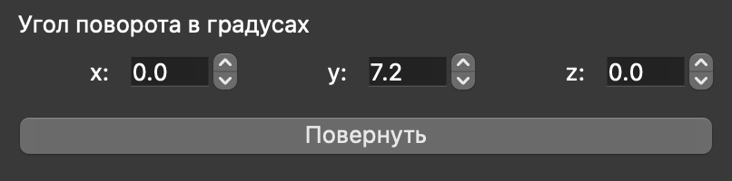

    - Кнопку/кнопки и поля ввода для масштабирования модели.  

  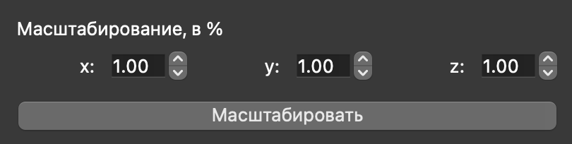

    - Информацию о загруженной модели - название файла, кол-во вершин и ребер.

  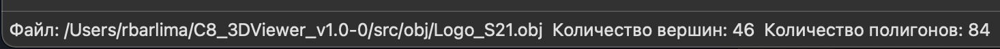

## Part 2. Дополнительно. Настройки

 - Программа позволяет настраивать тип проекции (параллельная и центральная)

  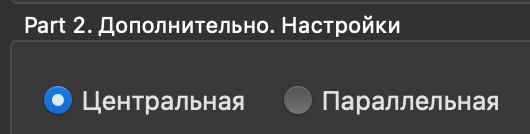

 - Программа позволяет настраивать тип (сплошная, пунктирная), цвет и толщину ребер, способ отображения (отсутствует, круг, квадрат), цвет и размер вершин

  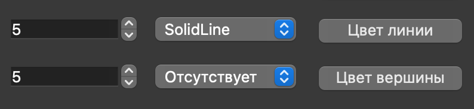

 - Программа позволяет выбирать цвет фона

  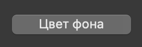

  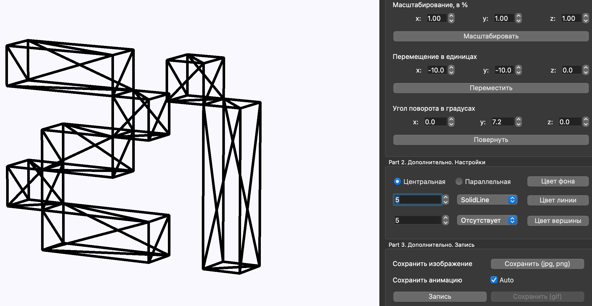

  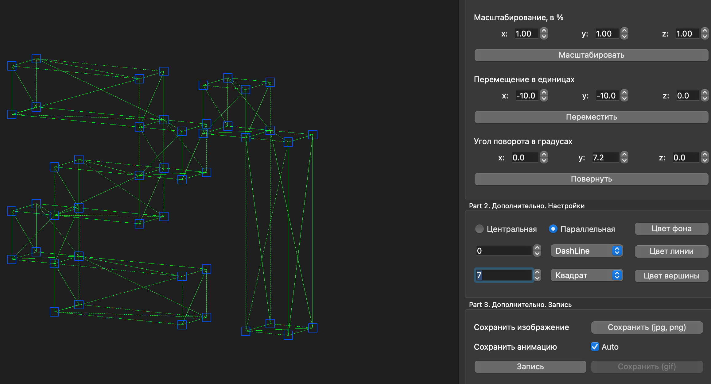    

 - Настройки сохраняются между перезапусками программы

 ## Part 3. Дополнительно. Запись

 - Программа позволяет сохранять полученные ("отрендеренные") изображения в файл в форматах bmp и jpeg

  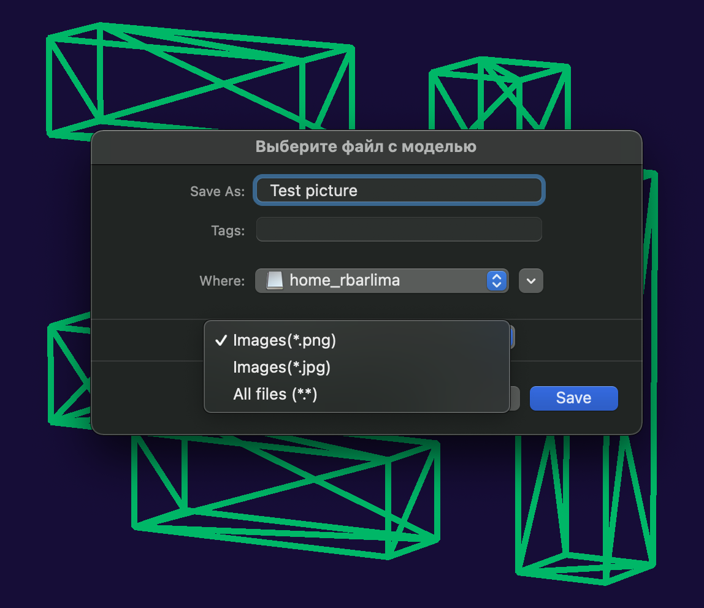

 - Программа позволяет по специальной кнопке записывать небольшие "скринкасты" - текущие пользовательские аффинные преобразования загруженного объекта в gif-анимацию (640x480, 10fps, 5s)

  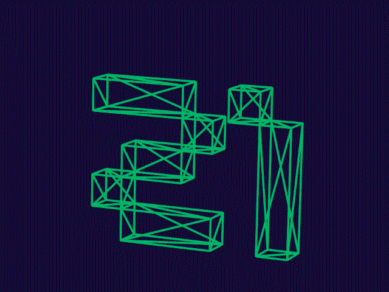