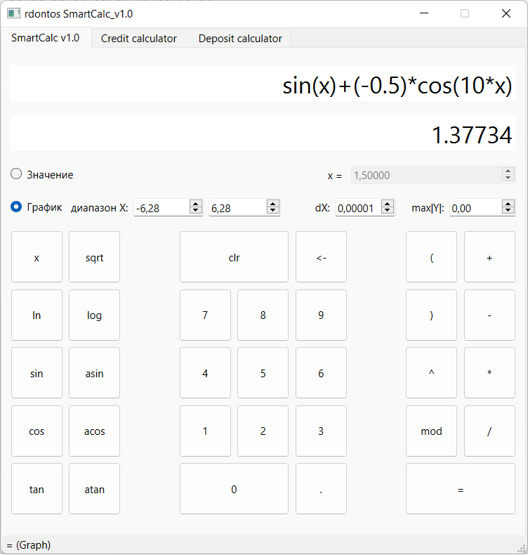
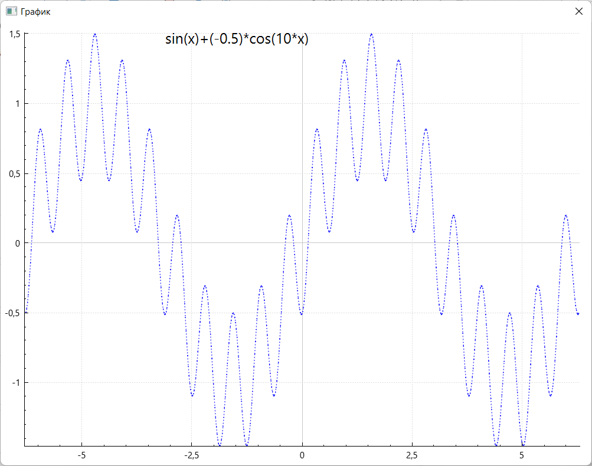
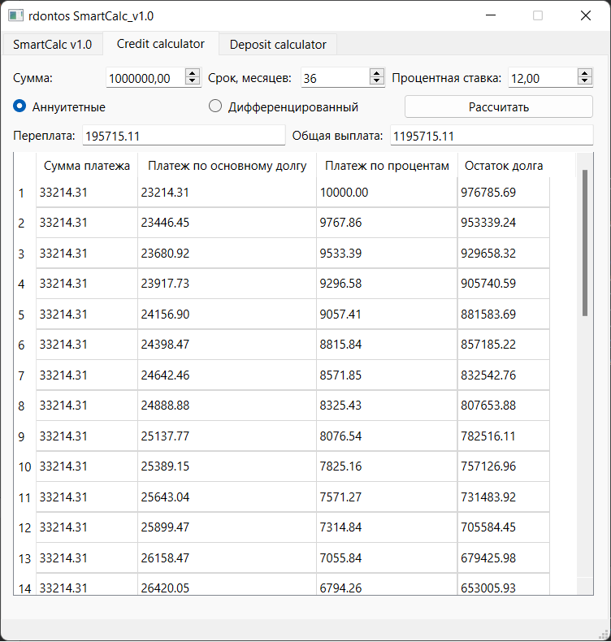
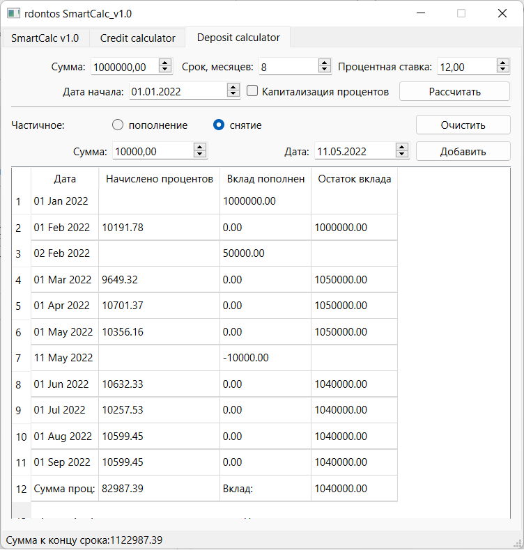

# SmartCalc v2.0

Реализация SmartCalc v2.0.

## Contents

3. [Chapter III](#chapter-iii) \
    3.1. [Part 1](#part-1-реализация-smartcalc-v20) \
    3.2. [Part 2](#part-2-дополнительно-кредитный-калькулятор) \
    3.3. [Part 3](#part-3-дополнительно-депозитный-калькулятор) 

## Introduction

В данном проекте реализована расширенная версия калькулятора. Вычисления арифметических выражений с учетом приоритетов, а так же некоторыми математическими функциями (синус, косинус, логарифм и т.д.). Помимо вычисления выражений калькулятор так же поддерживать использование переменной x и построение графика соответствующей функции. В качестве дополнительных улучшений реализован кредитный и депозитный калькулятор.

### Паттерн MVC

Паттерн MVC (Model-View-Controller, Модель-Представление-Контроллер) представляет из себя схему разделения модулей приложения на три отдельных макрокомпонента: модель, содержащую в себе бизнес-логику, представление - форму пользовательского интерфейса для осуществления взаимодействия с программой и контроллер, осуществляющий модификацию модели по действию пользователя.

## Chapter III

- Скриншот работы программы:

- Окно вывода графика:

## Part 1. Реализация SmartCalc v2.0

Необходимо реализовать SmartCalc v2.0:

- Программа должна быть разработана на языке C++ стандарта C++17
- Код программы должен находиться в папке src
- При написании кода необходимо придерживаться Google Style
- Классы должны быть реализованы внутри пространства имен `s21`
- Подготовить полное покрытие unit-тестами модулей, связанных с вычислением выражений, c помощью библиотеки GTest
- Сборка программы должна быть настроена с помощью Makefile со стандартным набором целей для GNU-программ: all, install, uninstall, clean, dvi, dist, tests. Установка должна вестись в любой другой произвольный каталог
- Реализация с графическим пользовательским интерфейсом, на базе любой GUI-библиотеки с API для C++17: Qt, SFML, GTK+, Nanogui, Nngui и т. д.
- Программа должна быть реализована с использованием паттерна MVC, а также:
    - не должно быть кода бизнес-логики в коде представлений
    - не должно быть кода интерфейса в контроллере и в модели
    - контроллеры должны быть тонкими
- На вход программы могут подаваться как целые числа, так и вещественные числа, записанные и через точку, и в экспоненциальной форме записи
- Вычисление должно производится после полного ввода вычисляемого выражения и нажатия на символ `=`
- Вычисление произвольных скобочных арифметических выражений в инфиксной нотации
- Вычисление произвольных скобочных арифметических выражений в инфиксной нотации с подстановкой значения переменной _x_ в виде числа
- Построение графика функции, заданной с помощью выражения в инфиксной нотации с переменной _x_  (с координатными осями, отметкой используемого масштаба и сеткой с адаптивным шагом)
    - Не требуется предоставлять пользователю возможность менять масштаб
- Область определения и область значения функций ограничиваются по крайней мере числами от -1000000 до 1000000
    - Для построения графиков функции необходимо дополнительно указывать отображаемые область определения и область значения
- Проверяемая точность дробной части - минимум 7 знаков после запятой
- У пользователя должна быть возможность ввода до 255 символов
- Скобочные арифметические выражения в инфиксной нотации должны поддерживать следующие арифметические операции и математические функции:
    - **Арифметические операторы**:

        | Название оператора | Инфиксная нотация   (Классическая) | Префиксная нотация   (Польская нотация) |  Постфиксная нотация   (Обратная польская нотация) |
        | ------ | ------ | ------ | ------ |
        | Скобки | (a + b) | (+ a b) | a b + |
        | Сложение | a + b | + a b | a b + |
        | Вычитание | a - b | - a b | a b - |
        | Умножение | a * b | * a b | a b * |
        | Деление | a / b | / a b | a b \ |
        | Возведение в степень | a ^ b | ^ a b | a b ^ |
        | Остаток от деления | a mod b | mod a b | a b mod |
        | Унарный плюс | +a | +a | a+ |
        | Унарный минус | -a | -a | a- |

        >Обратите внимание, что оператор умножения содержит обязательный знак `*`. Обработка выражения с опущенным знаком `*` является необязательной и остается на усмотрение разработчика

    - **Функции**:
  
        | Описание функции | Функция |   
        | ---------------- | ------- |  
        | Вычисляет косинус | cos(x) |   
        | Вычисляет синус | sin(x) |  
        | Вычисляет тангенс | tan(x) |  
        | Вычисляет арккосинус | acos(x) | 
        | Вычисляет арксинус | asin(x) | 
        | Вычисляет арктангенс | atan(x) |
        | Вычисляет квадратный корень | sqrt(x) |
        | Вычисляет натуральный логарифм | ln(x) | 
        | Вычисляет десятичный логарифм | log(x) |

## Part 2. Дополнительно. Кредитный калькулятор

Предусмотреть специальный режим "кредитный калькулятор" (за образец можно взять сайты banki.ru и calcus.ru):
 - Вход: общая сумма кредита, срок, процентная ставка, тип (аннуитетный, дифференцированный)
 - Выход: ежемесячный платеж, переплата по кредиту, общая выплата

 
- Скриншот программы:

## Part 3. Дополнительно. Депозитный калькулятор

Предусмотреть специальный режим "калькулятор доходности вкладов" (за образец можно взять сайты banki.ru и calcus.ru):
 - Вход: сумма вклада, срок размещения, процентная ставка, налоговая ставка, периодичность выплат, капитализация процентов, список пополнений, список частичных снятий
 - Выход: начисленные проценты, сумма налога, сумма на вкладе к концу срока

- Скриншот программы:

