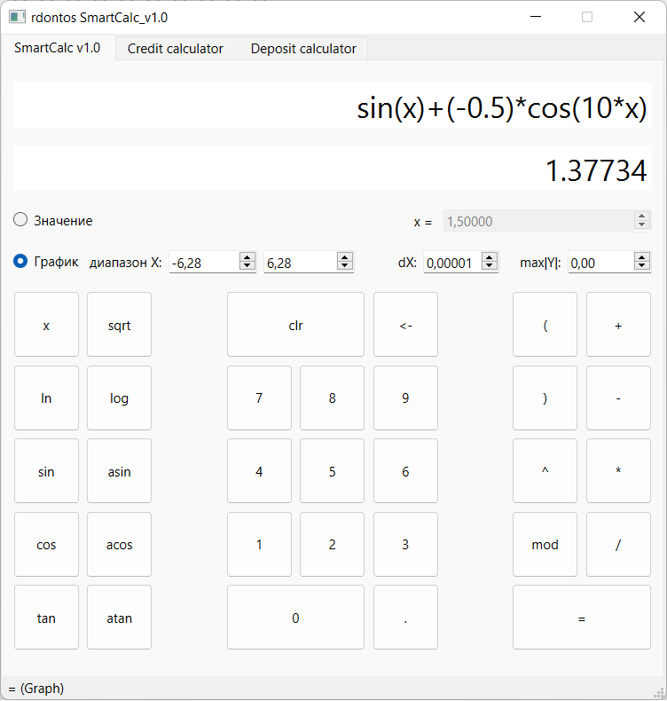
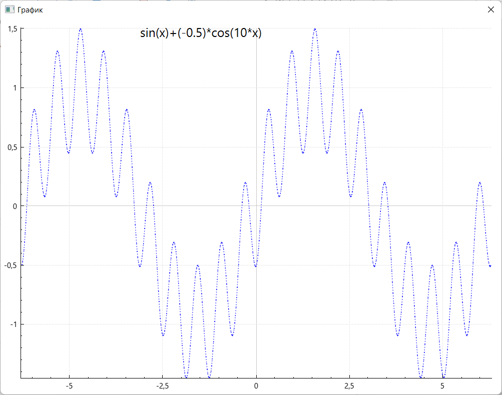
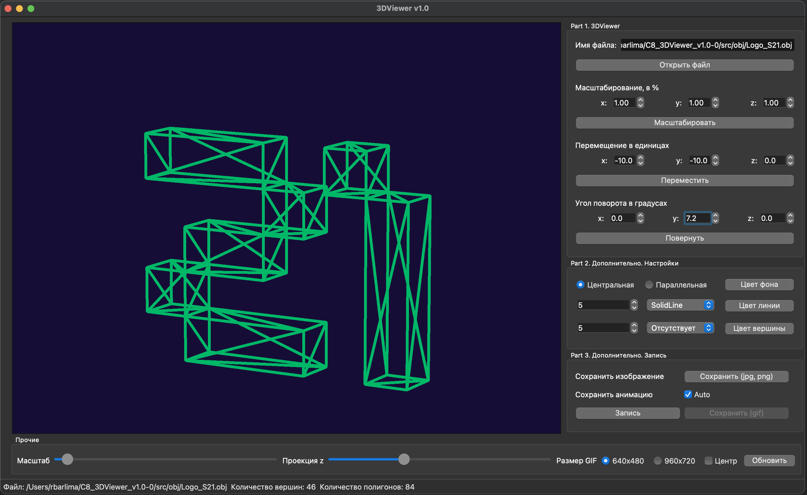

# school21

Некоторые проекты, написанные в рамках обучения в школе21.

## В папке QT визуальные проекты, 3dviewer и SmartCalc

### SmartCalc

Вычисление произвольных скобочных арифметических выражений в инфиксной нотации с подстановкой значения переменной _x_ в виде числа. Построение графика функции, заданной с помощью выражения в инфиксной нотации с переменной _x_ (с координатными осями, отметкой используемого масштаба и сеткой с адаптивным шагом.

- Скриншот режима построения графика:

- Окно вывода графика:

### 3DViewer

Программа для визуализации каркасной модели в трёхмерном пространстве. Программа предоставляет возможность:

    - Загружать каркасную модель из файла формата obj (поддержка только списка вершин и поверхностей).
    - Перемещать модель на заданное расстояние относительно осей X, Y, Z.
    - Поворачивать модель на заданный угол относительно своих осей X, Y, Z
    - Масштабировать модель на заданное значение.

## В папке СPP находятся проекты, для практики в ООП: matrix, containers.

### s21_matrix+

- Реализовать матрицу в виде класса `S21Matrix`. А так же поиск обратной матрицы, определитель, переопределить умножение матриц и прочие функции.

### s21_containers

- Реализовать собственную библиотеку, реализующую основные стандартные контейнерные классы языка С++: `list` (список), `map` (словарь), `queue` (очередь), `set` (множество), `stack` (стек) и `vector` (вектор). Реализации должны предоставлять весь набор стандартных методов и атрибутов для работы с элементами.

## В папке DevOps пошаговые дейстивия, по настройке сети и маршрутизации , запуска веб-сервера в docker.

### Сети в Linux

- Поднять пять виртуальных машин (3 рабочие станции (ws11, ws21, ws22) и 2 роутера (r1, r2))

### Simple Docker

- Поднять докер контейнер с **nginx**, который будет проксировать все запросы с 8080 порта на 81 порт первого контейнера

